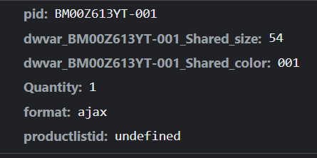
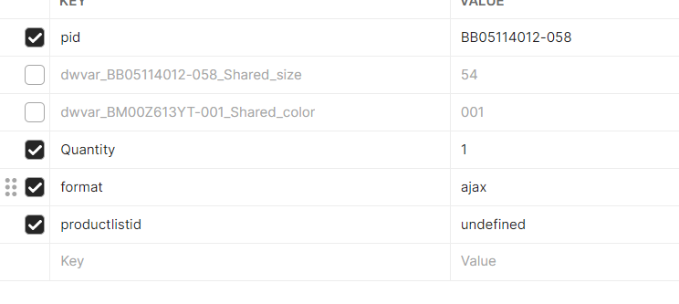
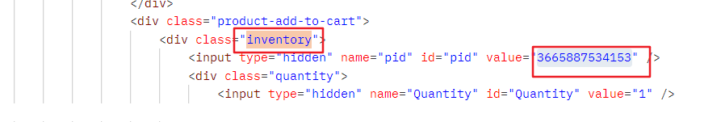

class="search-results-content productgrid"

https://www.givenchy.com/fr/fr/femme/sacs/sacs-porte-croise/?start=20&sz=20

https://www.givenchy.com/fr/fr/homme/sacs/petite-maroquinerie/?start=20&sz=20

https://www.givenchy.com/fr/fr/homme/pret-a-porter/bombers-blousons/?start=20&sz=20

从  getpos  里面出来的 讯息应该是  url   而不是 id

从  url   get   到有基本信息的 html

此 链接 获得大小对应店铺

https://www.givenchy.com/on/demandware.store/Sites-GIV_FR-Site/fr/FindInStore-Find?pid=3665887534153&filter_country=fr&show_name=true

此链接获得  大小对应  id       有大小的 该链接会存在于  大小标签下

https://www.givenchy.com/on/demandware.store/Sites-GIV_FR-Site/fr/Product-Variation?pid=BM00Z613YT-001&dwvar_BM00Z613YT-001_Shared_size=54&dwvar_BM00Z613YT-001_Shared_color=001&Quantity=1&format=ajax&productlistid=undefined

没有大小的也可以使用该链接

提交表单为

id 位置
